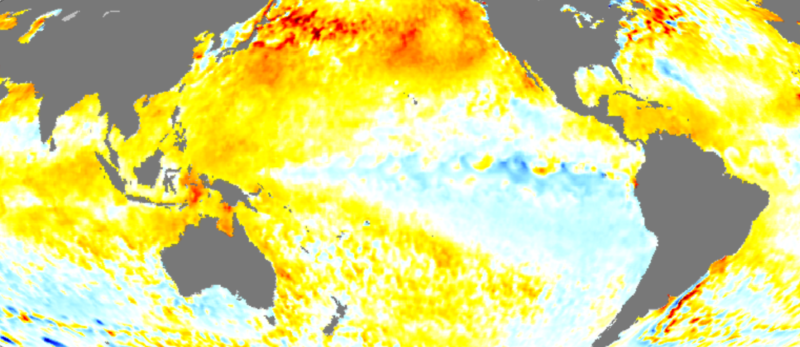

# 라니냐가 온다

지난 9월에 우리나라 기상청과 NOAA 기후예측센터(CPC)의 ENSO 경보시스템은 라니냐가 시작되었고 북반구에서는 겨울동안 그 영향이 지속될 전망이라고 공식 발표하였다.

기후변화는 대기와 해양의 밀접한 상호작용속에서 일어난다. 과학자들은 이러한 기후변화에서 시공간적으로 다양한 패턴들을 찾아내고 있다. 어떤 패턴은 천년에서 십만 년 주기로 일어나는 반면에 어떤 패턴은 수년에서 수십년 주기로 발생한다. 이들 중 많이 알려진 것이 엘리뇨-남방진동으로 2-7년 마다 일어나고 있다. 평상시에는 적도를 따라 서태평양(인도네시아 부근)에서 기압이 낮고, 동태평양(이스터섬 부근)에 고기압이 위치한다. 이러한 기압 차는 남태평양의 적도 해역을 횡단하는 강한 남동무역풍을 일으킨다(그 결과 형성되는 대기의 순환세포를 워커순환세포라고 함). 남동무역풍은 따뜻한 바닷물을 태평양을 가로질러 동쪽에서 서쪽으로 밀어내어 서태평양에 두꺼운 난수역(Warm Pool)을 형성하면서 해수면 높이가 동태평양에 비해 50cm 정도 높아진다. 이 때 태평양의 동서를 가로질러 수온약층(더운 상층수와 차가운 심층수 사이의 경계층)은 서쪽보다 동쪽에서 더 얕아지는 경사면을 이룬다. 따라서 중남미 연안을 따라 차갑고 영양염류가 풍부한 심층수가 용승하여 생산력을 높여주고 해양생물이 풍부한 어장이 형성된다.

* Consectetur adipiscing elit
* Donec a diam lectus
* Sed sit amet ipsum mauris

Ut turpis felis, pulvinar a semper sed, adipiscing id dolor. Pellentesque auctor nisi id magna consequat sagittis. Curabitur dapibus enim sit amet elit pharetra tincidunt feugiat nisl imperdiet. Ut convallis libero in urna ultrices accumsan. Donec sed odio eros. Donec viverra mi quis quam pulvinar at malesuada arcu rhoncus. Cum sociis natoque penatibus et magnis dis parturient montes, nascetur ridiculus mus. In rutrum accumsan ultricies. Mauris vitae nisi at sem facilisis semper ac in est.

Nunc diam velit, adipiscing ut tristique vitae, sagittis vel odio. Maecenas convallis ullamcorper ultricies. Curabitur ornare, ligula *semper consectetur sagittis*, nisi diam iaculis velit, id fringilla sem nunc vel mi. Nam dictum, odio nec pretium volutpat, arcu ante placerat erat, non tristique elit urna et turpis. Quisque mi metus, ornare sit amet fermentum et, tincidunt et orci. Fusce eget orci a orci congue vestibulum.

Ut dolor diam, elementum et vestibulum eu, porttitor vel elit. Curabitur venenatis pulvinar tellus gravida ornare. Sed et erat faucibus nunc euismod ultricies ut id justo. Nullam cursus suscipit nisi, et ultrices justo sodales nec. Fusce venenatis facilisis lectus ac semper. Aliquam at massa ipsum. Quisque bibendum purus convallis nulla ultrices ultricies. Nullam aliquam, mi eu aliquam tincidunt, purus velit laoreet tortor, viverra pretium nisi quam vitae mi. Fusce vel volutpat elit. Nam sagittis nisi dui.

> Suspendisse lectus leo, consectetur in tempor sit amet, placerat quis neque

Etiam luctus porttitor lorem, sed suscipit est rutrum non. Curabitur lobortis nisl a enim congue semper. Aenean commodo ultrices imperdiet. Vestibulum ut justo vel sapien venenatis tincidunt.

Phasellus eget dolor sit amet ipsum dapibus condimentum vitae quis lectus. Aliquam ut massa in turpis dapibus convallis. Praesent elit lacus, vestibulum at malesuada et, ornare et est. Ut augue nunc, sodales ut euismod non, adipiscing vitae orci. Mauris ut placerat justo. Mauris in ultricies enim. Quisque nec est eleifend nulla ultrices egestas quis ut quam. Donec sollicitudin lectus a mauris pulvinar id aliquam urna cursus. Cras quis ligula sem, vel elementum mi. Phasellus non ullamcorper urna.
